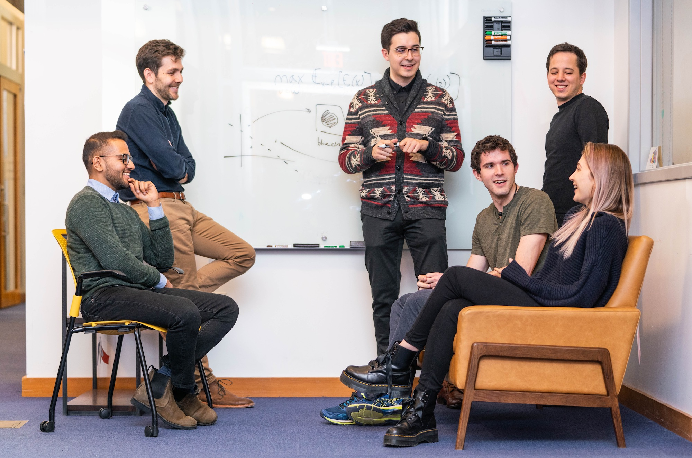

We're interested in what machine learning can do for language understanding and
what language data can do for other machine learning problems. We develop tools
for building systems that can learn from instructions, explain their decisions,
and make human-like generalizations. Take a look at [who we are](people.html)
and [what we're thinking about](research.html)!

