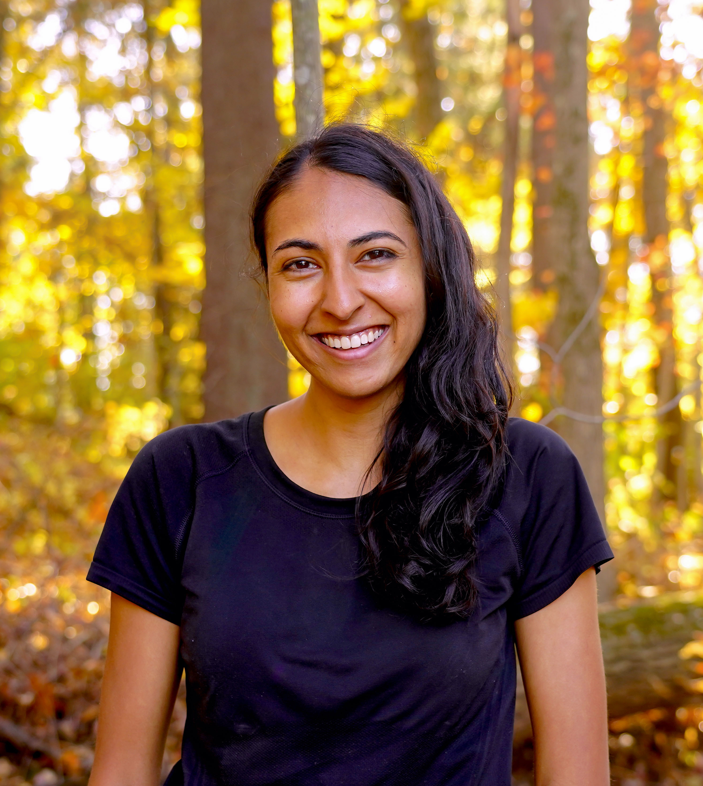

## PhD Students

<ul class="people">
  <li>
    <a href="https://www.mit.edu/~akyurek"> 
    
    Ekin Akyürek
    </a>
  </li>
  <li>
    <a href="https://evandez.com/">
    
    Evan Hernandez
    </a>
  </li>
  <li>
    <a href="https://apjacob.me/">
    
    Athul Paul Jacob
    </a>
  </li>
  <li>
    <a href="https://pratyushasharma.github.io/">
    
    Pratyusha Sharma
    </a>
  </li>
  <li>
    <a href="https://andipeng.com/">
    
    Andi Peng
    </a>
  </li>
  <li>
    <a href="https://belindal.github.io/">
    
    Belinda Li
    </a>
  </li>
  <li>
    <a href="https://www.gabegrand.com/">
    
    Gabe Grand 
    </a>
  </li>
  <li>
    <a href="https://web.mit.edu/zyzzyva/www/academic.html">
    
    Lionel Wong
    </a>
  </li>
  <li>
    <a href="https://alexisjihyeross.github.io/">
    
    Alexis Ross
    </a>
  </li> 
</ul>

## Postdocs 

<ul class="people">
  <li>
    <a href="https://chengxuz.github.io/">
    
    Chengxu Zhang 
    </a>
  </li>
  <li>
    <a href="https://ccolas.github.io">
    
    C&eacute;dric Colas
    </a>
  </li>
  <li>
    <a href="https://ktilana.wixsite.com/leshem-choshen">
    
    Leshem Choshen
    </a>
  </li>
</ul>

## MEngs and undergrads
<ul class="people">
  <li>
    Eric Zhang
  </li>
  <li>
    Jason Lee
  </li>
  <li>
    Ziqian Zhong
  </li>
  <li>
    Rishab Parthasarathy
  </li>
</ul>

## Friends & Visitors

<ul class="people">
  <li>
    <a href="https://feyzaakyurek.github.io/">
    
    Feyza Aky&uuml;rek
    </a>
  </li>
  <li>
    <a href="https://nightingal3.github.io/">
    
    Emmy Liu
    </a>
  </li>
  <li>
    <a href="https://web.stanford.edu/~meghas/">
    
    Megha Srivastava
    </a>
  </li>
</ul>

## Admin

<ul class="people">
  <li>
    <a href="mailto:nhiggins@mit.edu">
      Nathan Higgins
    </a>
  </li>
</ul>

## Faculty

<ul class="people">
  <li>
    <a href="https://web.mit.edu/jda/www/">
      
      Jacob Andreas
    </a>
  </li>
</ul>

## Alumni

<ul class="people">
<li>Anna Ivanova (Postdoc)</li>
<li>William Chen (SB)</li>
<li>Kevin Liu (MEng)</li>
<li>Jiahai Feng (SB)</li>
<li>Noa Korneev (SB)</li>
<li>Matt Kearney (MEng)</li>
<li>Shinjini Ghosh (MEng)</li>
<li>Max Nye (PhD, BCS)</li>
<li>Eric Chu (PhD, Media Lab)</li>
<li>Josue Torres Fonseca (SB, Boise State)</li>
<li>Nafisa Rashid (SB, Wellesley)</li>
<li>Anjali Kantharuban (SB, UC Berkeley)</li>
<li>Teona Bagashvili (SB, Allegheny College)</li>
<li>Alana Marzoev (PhD)</li>
<li>Joe O'Connor (MEng)</li>
<li>Anthony Bau (MEng)</li>
<li>Nitya Parthasarathy (SB)</li>
<li>Jesse Mu (PhD, Stanford)</li>
</ul>
