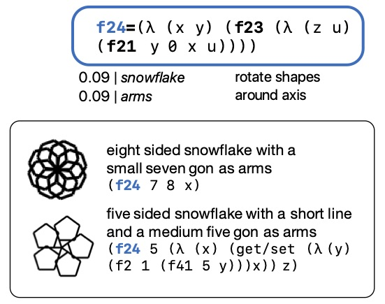
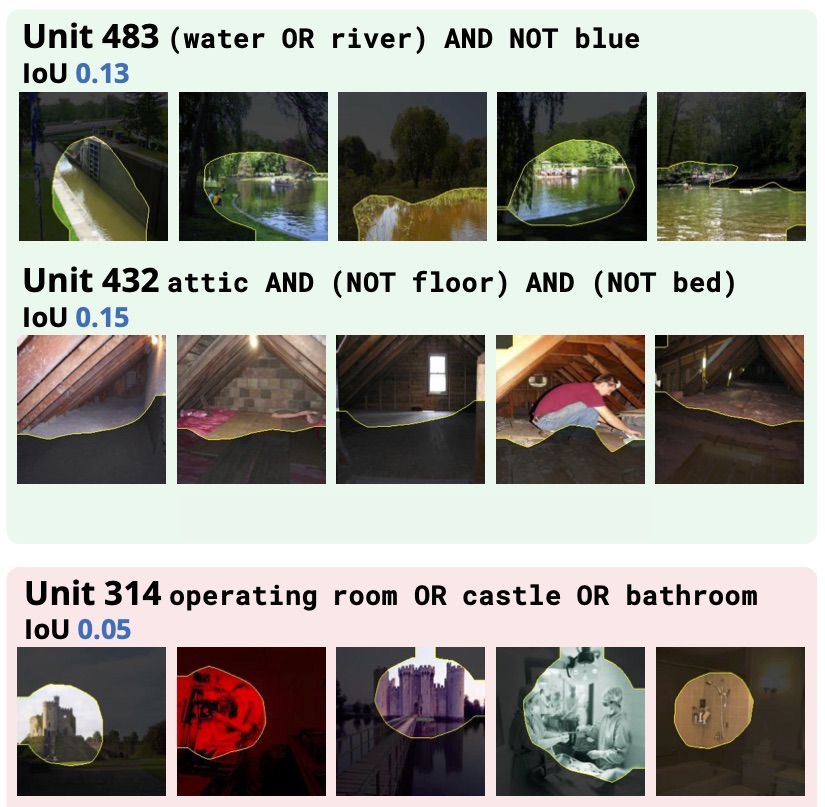

## Research highlights

<ul class="paper-highlights">

<li>
  

  <b>Neural language models learn implicit representations of meaning from text alone.</b> 
  (paper coming soon!)
  

  

  Belinda Z. Li, Maxwell Nye and Jacob Andreas. ACL 2021.
  

  

  

  Language models (trained to predict missing words in sentences and paragraphs)
learn to build structured representations of the state of the world. These
representations support model-internal reasoning about the consequences of actions
(like mixing a beaker or unlocking a door with a key).  The organization of
semantic information in language model embeddings bears striking resemblance to
formal meaning representations like DRT and file change semantics from the
linguistics literature, suggesting that it's possible to discover a little bit
about how meaning works with nothing but text as training data.
  

</li>

<li>
  

  <b>Leveraging language to learn program abstractions and search heuristics.</b> 
  (paper coming soon!)
  

  

  Catherine Wong, Kevin Ellis, Joshua B. Tenenbaum and Jacob Andreas. ICML 2021.
  

  

  

  Can natural language enable better automated reasoning about programming
languages? We describe
  how to generalize a recent Bayesian model for program synthesis to incorporate
  text-based hints and heuristics, and show that even small amounts of side
  information from language dramatically improve this model's ability to
  discover
  reusable abstractions for visual reasoning and programming by demonstration.
  Natural language is a useful source of supervision even for learning problems
that don't involve language as input or output.
  

</li>

<li>
  

  <b><a href="https://arxiv.org/abs/2006.14032">Compositional explanations of neurons</a>.</b>
  

  

  Jesse Mu and Jacob Andreas. NeurIPS 2020.
  

  

  

  We explain the behavior of deep network models by approximating each neuron
  with an executable program or logical form. These compositional explanations
  let us automatically quantify (aspects of) the complexity, interpretability, and
  naturalness of learned abstractions in vision and language models.  They surface
  a number of surprising successes (image classifiers discover abstract functional
  categories like "sports facility" without supervision) but also sources of
  brittleness (vision models easily confuse washing machines with viaducts and
  cribs with fire escapes, and language processing models are easily tricked by
  surprising combinations of pronouns).  
  

</li>
</ul>

## Full paper list

### 2021

- Leveraging language to learn program abstractions and search heuristics.

  Catherine Wong, Kevin Ellis, Joshua B. Tenenbaum and Jacob Andreas. ICML 2021.

- Neural language models learn approximate models of meaning from form alone.

  Belinda Z. Li, Maxwell Nye and Jacob Andreas. ACL 2021.

- How much context information can transformer language models use?

  Joe O'Connor and Jacob Andreas. ACL 2021.

- Lexicon learning for few-shot sequence modeling.

  Ekin Aky&uuml;rek and Jacob Andreas. ACL 2021.

- [Multitasking inhibits semantic drift](https://arxiv.org/abs/2104.07219).

  Athul Paul Jacob, Mike Lewis and Jacob Andreas. NAACL 2021.

- [Representing partial programs with blended abstract
  semantics](https://arxiv.org/abs/2012.12964).

  Maxwell Nye, Yewen Pu, Matthew Bowers, Jacob Andreas, Joshua B. Tenenbaum,
  Armando Solar-Lezama. ICLR 2021.

- [Learning to recombine and resample data for compositional
  generalization](https://arxiv.org/abs/2010.03706).

  Ekin Aky&uuml;rek, Afra Feyza Aky&uuml;rek and Jacob Andreas. ICLR 2021.

### 2020

- [Compositional explanations of neurons](https://arxiv.org/abs/2006.14032).

  Jesse Mu and Jacob Andreas. NeurIPS 2020.

- [A benchmark for systematic generalization in grounded language
   understanding.](https://arxiv.org/abs/2003.05161)

  Laura Ruis, Jacob Andreas, Marco Baroni, Diane Bouchacourt and Brenden Lake.
  NeurIPS 2020.

- [Good-Enough Compositional Data Augmentation](
  https://arxiv.org/abs/1904.09545).

  Jacob Andreas. ACL 2020.

- [Unnatural language processing: bridging the gap between synthetic and natural
  language data](https://arxiv.org/abs/2004.13645).

  Alana Marzoev, Sam Madden, Frans Kaashoek, Mike Cafarella and Jacob Andreas.
  NeurIPS workshop on Emergent Communication.

### 2019

- [A survey of reinforcement learning informed by natural language](
  https://arxiv.org/abs/1906.03926).

  Jelena Luketina, Nantas Nardelli, Gregory Farquhar, Jakob Foerster, Jacob
  Andreas, Edward Grefenstette, Shimon Whiteson and Tim Rocktäschel. IJCAI 2019.

- [Measuring compositionality in representation learning](
  https://arxiv.org/abs/1902.07181).

  Jacob Andreas. ICLR 2019.
